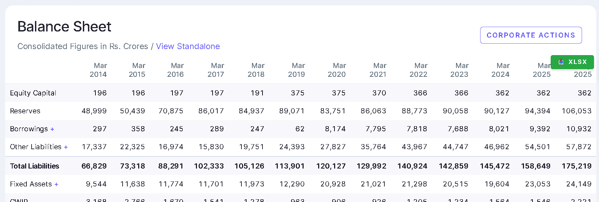
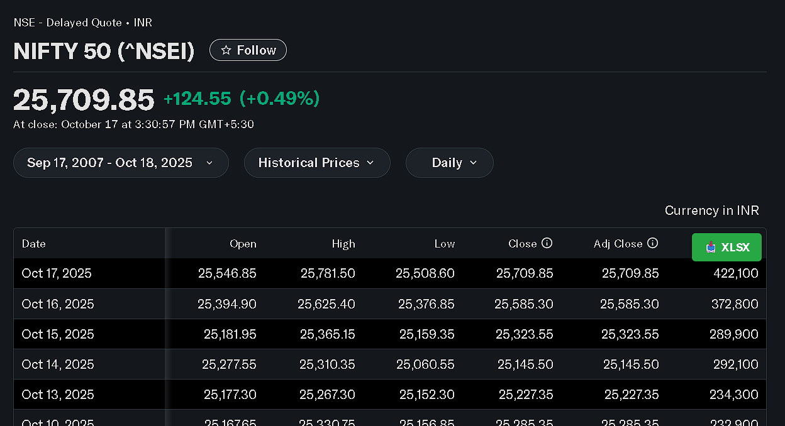
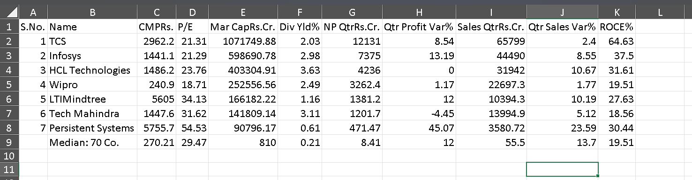
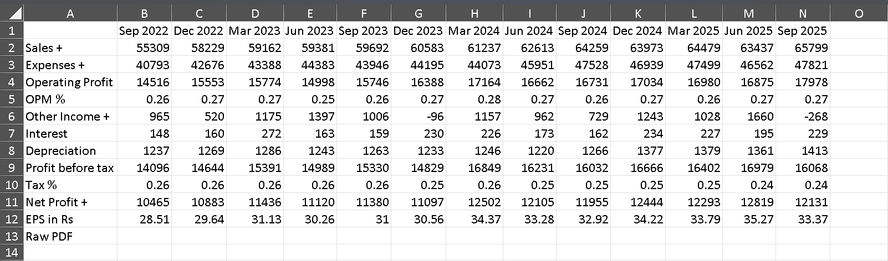
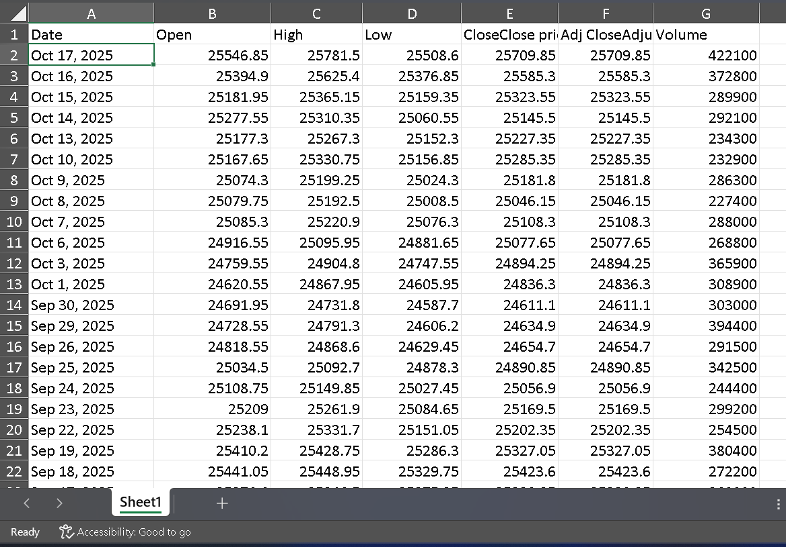

# Table to Excel Exporter

## Overview

Table to Excel Exporter is a Chrome browser extension designed to streamline the process of extracting tabular data from web pages. If you've ever spent time manually copying and pasting data from online tables into spreadsheets, this tool will save you significant time and effort.

The extension works by automatically detecting all HTML tables on any webpage you visit and adding a discrete download button to each one. With a single click, you can export the entire table as a properly formatted Excel (.xlsx) file, ready for analysis or further processing.

## Key Features

This extension provides several capabilities that make working with web-based data more efficient:

- **Universal Compatibility**: Works on any website containing HTML tables, from Wikipedia and financial sites to internal dashboards and research databases
- **One-Click Export**: Simple, intuitive interface requiring no technical knowledge
- **Native Excel Format**: Generates genuine .xlsx files compatible with Microsoft Excel, Google Sheets, LibreOffice Calc, and other spreadsheet applications
- **Dynamic Table Detection**: Automatically identifies tables that load asynchronously or are added to the page after initial load
- **Minimal Visual Impact**: Adds only a small, unobtrusive button that doesn't interfere with the page's layout or functionality
- **Intelligent File Naming**: Attempts to generate meaningful filenames based on table captions or surrounding headings rather than generic names

This tool is particularly valuable for students conducting research, financial analysts tracking market data, business professionals compiling reports, and anyone who regularly works with data published on the web.

## Installation Guide

Installing this extension requires two main steps: obtaining a required library file and loading the extension into Chrome. The process is straightforward and should take only a few minutes.

### Prerequisites

Before installing the extension, you'll need to download the SheetJS library, which handles the conversion of HTML tables to Excel format. This is a widely-used, open-source library that's both free and safe to use.

**Download Instructions:**

1. Navigate to: [https://cdn.sheetjs.com/xlsx-0.20.3/package/dist/xlsx.full.min.js](https://cdn.sheetjs.com/xlsx-0.20.3/package/dist/xlsx.full.min.js)
2. Your browser will likely display the JavaScript code directly. This is expected behavior.
3. Right-click anywhere on the page and select "Save As" (or "Save Page As")
4. Ensure the file is saved with the exact name `xlsx.full.min.js` (verify it's not saved as .txt or .html)
5. Save this file in the same directory as the other extension files

**Note**: The SheetJS library is necessary because Chrome extensions have limitations on bundling large JavaScript libraries directly. This approach keeps the extension lightweight while providing full Excel generation capabilities.

### Loading the Extension

Once you have the required library file, follow these steps to install the extension:

1. Open Google Chrome and navigate to `chrome://extensions/`
2. In the top-right corner of the extensions page, locate the "Developer mode" toggle switch
3. Enable Developer mode by clicking the toggle (it should turn blue/active)
4. Three new buttons will appear. Click "Load unpacked"
5. In the file browser dialog that appears, navigate to and select your extension folder
6. Click "Select Folder" to confirm

The extension should now appear in your list of installed extensions with the name "Table to Excel Exporter". You're ready to start using it.

## Usage

Once installed, the extension operates automatically on every webpage you visit. The workflow is intentionally simple:

1. Navigate to any webpage containing data tables
2. The extension will automatically add a green "📥 XLSX" button to the top-right corner of each table
3. Click the button on the table you wish to export
4. The Excel file will download immediately to your default Downloads folder

The extension attempts to generate meaningful filenames by examining table captions and nearby heading elements. If these aren't available, it will use a numbered naming scheme (e.g., "table_1.xlsx", "table_2.xlsx").

### Suggested Test Sites

To familiarize yourself with the extension's functionality, consider testing it on these sites, which typically contain well-structured tables:

- **Wikipedia**: Articles with statistical data (e.g., List of countries by population)
- **Financial websites**: Stock market data, company financials, economic indicators
- **Sports statistics sites**: Player stats, team rankings, historical records
- **Government data portals**: Census data, economic reports, public datasets
- **E-commerce sites**: Product comparison tables, pricing matrices

The extension works equally well on public websites and internal web applications, provided the data is presented in standard HTML table format.

## Use Cases and Examples

The following examples demonstrate real-world applications of this extension across different domains. These screenshots show actual tables exported from various websites.

### Example 1: Stock Market Data (Nifty 50)



Export daily trading data with Open, High, Low, Close prices and Volume:
- **Use case**: Track stock performance, analyze trends, create charts
- **Before**: Historical price table on Yahoo Finance or similar sites
- **After**: Clean Excel file ready for analysis with all OHLC data

---

### Example 2: Company Balance Sheets



Download financial statements from annual reports:
- **Use case**: Compare company finances year-over-year, financial analysis
- **Before**: Balance sheet table on corporate websites
- **After**: Excel file with Equity Capital, Reserves, Assets, Liabilities over multiple years

---

### Example 3: Stock Market Historical Data



See the table **on the website** with export button (notice the green XLSX button):
- **Before**: Complex historical price tables on financial websites
- **After**: One-click export to analyze in Excel

---

### Example 4: Company Rankings & Comparisons



Download comparative tables of multiple companies:
- **Use case**: Compare P/E ratios, market cap, dividend yields, ROE across companies
- **Before**: Comparison table of top companies (TCS, Infosys, HCL, etc.)
- **After**: Excel file for investment research and screening

---

### Example 5: Quarterly Performance Metrics



Export key performance indicators and quarterly results:
- **Use case**: Track sales growth, profit margins, quarterly trends
- **Before**: Tables showing Sales, Expenses, Operating Profit, Net Profit by quarter
- **After**: Spreadsheet ready for forecasting and business analysis

### Applications of Exported Data

Once you've exported tables to Excel format, you can:

- Perform statistical analysis and calculations
- Create visualizations (charts, graphs, pivot tables)
- Merge data from multiple sources for comprehensive analysis
- Share structured data with colleagues, clients, or team members
- Generate professional reports and presentations
- Import into business intelligence tools (Power BI, Tableau, Looker, etc.)
- Build financial models or forecasts
- Archive data for historical record-keeping

## File Structure

The extension consists of several core files, each serving a specific purpose:

| File | Purpose |
|------|---------|
| `manifest.json` | Extension configuration file defining permissions, scripts, and metadata |
| `content.js` | Main script that detects tables, injects UI elements, and handles export logic |
| `xlsx.full.min.js` | SheetJS library for Excel file generation (downloaded separately) |
| `README.md` | Documentation and usage instructions |
| `INSTALLATION.txt` | Quick-reference installation guide |

## Testing and Verification

To verify the extension is working correctly, try these test pages known for containing well-structured tables:

- [List of countries by population (Wikipedia)](https://en.wikipedia.org/wiki/List_of_countries_by_population)
- [HTML Tables Tutorial (W3Schools)](https://www.w3schools.com/html/html_tables.asp)
- Any Wikipedia article containing data tables or statistical information

After visiting these pages, you should see the export buttons appear within a few seconds. If buttons don't appear, consult the Troubleshooting section below.

## Customization Options

For users comfortable with JavaScript and JSON, the extension can be modified to suit specific needs.

### Modifying Button Appearance

To change the button's visual styling, edit `content.js` (approximately lines 30-40):

```javascript
button.style.backgroundColor = '#28a745';  // Button color (hex code)
button.style.padding = '6px 12px';         // Button size
button.textContent = '📥 XLSX';             // Button label text
```

### Restricting to Specific Websites

If you only need the extension to work on certain sites, modify the `manifest.json` file:

```json
"matches": ["<all_urls>"]  // Change to ["https://example.com/*"] for specific domain
```

This can improve performance if you only work with tables on particular websites.

### Custom Filename Generation

The filename generation logic can be found in `content.js` starting around line 70. You can modify this function to implement custom naming conventions based on your workflow requirements.

### Technical Architecture

For developers interested in the implementation details:

- **Framework**: Chrome Extension Manifest V3
- **Excel Generation**: SheetJS (xlsx.js) library
- **Table Detection**: MutationObserver API for monitoring DOM changes
- **Processing**: Entirely client-side (no server communication required)
- **Scope**: Content script injected into all pages matching the manifest pattern

## Troubleshooting

### Export Buttons Not Appearing

If you don't see the download buttons on tables, try these steps in order:

1. **Verify library file**: Confirm that `xlsx.full.min.js` exists in your extension folder. The file should be approximately 800KB in size.
2. **Reload the extension**: Navigate to `chrome://extensions/`, locate "Table to Excel Exporter", and click the reload icon.
3. **Refresh the webpage**: Press F5 or Ctrl+R to reload the page you're testing.
4. **Check for errors**: Open Developer Tools (F12), select the "Console" tab, and look for error messages in red text.

If problems persist, the page may be using non-standard table structures or have a Content Security Policy that blocks the extension.

### Download Function Not Working

If the button appears but clicking it doesn't download a file:

- Check Chrome's download blocking notification (icon may appear in the address bar)
- Verify you have write permissions to your Downloads folder
- Test on a simpler webpage to isolate the issue
- Ensure the table contains actual data (some decorative tables may be empty)

### Visual Layout Issues

In rare cases, the added button may affect the page's visual layout:

- This typically occurs on pages with complex CSS styling
- Refresh the page (F5) to reset the layout
- The button uses absolute positioning specifically to minimize interference
- If issues persist, you may need to adjust the button's CSS in `content.js`

### File Location

Downloaded files are saved to your browser's default download location:

- **Windows**: `C:\Users\[YourName]\Downloads`
- **macOS**: `/Users/[YourName]/Downloads`
- **Linux**: `~/Downloads`

You can view all downloads by pressing Ctrl+J (Cmd+J on Mac) in Chrome.

## Browser Compatibility

| Browser | Support Level | Notes |
|---------|---------------|-------|
| Google Chrome | Full support | Primary development target |
| Microsoft Edge | Full support | Chromium-based, identical functionality to Chrome |
| Firefox | Partial | May require manifest modifications |
| Safari | Not supported | Requires different extension architecture |

## Capabilities and Limitations

### What Works Well

The extension handles most common table scenarios effectively:

- Standard HTML tables on any publicly accessible website
- Tables containing text, numbers, hyperlinks, and basic formatting
- Large tables with hundreds or thousands of rows
- Multiple tables on a single page (each gets its own export button)
- Tables that load asynchronously via JavaScript

### Known Limitations

Be aware of these constraints when using the extension:

- **Cross-origin iframes**: Cannot access tables within iframes hosted on different domains (browser security restriction)
- **Strict CSP sites**: Some high-security sites (banking, government) may have Content Security Policies that prevent extension scripts from running
- **Formatting preservation**: Visual styling (colors, fonts, borders) is not preserved; only data and structure are exported
- **Complex cell merging**: While basic merged cells are handled, complex spanning arrangements may not render identically in Excel
- **Non-table data**: The extension only detects semantic HTML `<table>` elements, not tables created with CSS grid or flexbox layouts

## Roadmap and Future Enhancements

Potential improvements under consideration:

- [ ] Extension icon design for better visual identification
- [ ] Settings panel for user customization preferences
- [ ] Bulk export functionality (download all tables from a page simultaneously)
- [ ] Alternative export formats (CSV, JSON, etc.)
- [ ] Preservation of cell formatting and styling in exports
- [ ] Context menu integration (right-click to export)
- [ ] Custom download location selector
- [ ] Column filtering/selection before export

Contributions and feature suggestions are welcome.

## Privacy and Security

This extension prioritizes user privacy and operates with minimal permissions:

- **Data Processing**: All table conversion happens locally in your browser. No data is transmitted to external servers.
- **Permissions**: The extension only requests access to the active tab and runs content scripts on pages you actively visit.
- **Dependencies**: Uses the widely-trusted SheetJS library for Excel generation. This library is open-source and can be audited.
- **No Tracking**: The extension includes no analytics, tracking, or telemetry of any kind.
- **Open Source**: All source code is available for inspection, ensuring transparency about functionality.

## License and Usage Rights

This extension is provided free of charge for both personal and commercial use. You may:

- Use the extension for any purpose (personal, academic, commercial)
- Modify the source code to suit your needs
- Redistribute the original or modified versions
- Incorporate it into other projects

No attribution is required, though it's appreciated.

## Support and Contributing

**For General Users:**

If you encounter issues, please review the troubleshooting section above. For installation assistance, consult the INSTALLATION.txt file included with the extension.

**For Developers:**

Technical questions and contributions can be directed through the project repository. The extension uses:

- [SheetJS (xlsx.js)](https://sheetjs.com) for Excel file generation
- Chrome Extension Manifest V3 architecture
- Content scripts with MutationObserver for dynamic table detection
- Client-side processing exclusively (no backend required)

---

This extension was created to solve a common problem: extracting tabular data from websites efficiently. Whether you're a student, analyst, researcher, or professional working with web-based data, we hope this tool saves you time and improves your workflow.
